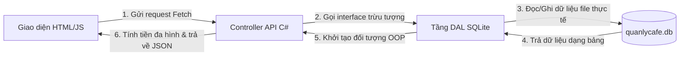

# 🗺️ BẢN ĐỒ CẤU TRÚC DỰ ÁN QUẢN LÝ QUÁN CAFE

Tài liệu này giải thích chi tiết ý nghĩa, chức năng và vai trò của từng thư mục, từng tệp tin trong dự án để giúp bạn dễ dàng nắm bắt toàn bộ mã nguồn và tự tin trả lời mọi câu hỏi của giảng viên khi bảo vệ đồ án.

---

## 🧭 SƠ ĐỒ TỔNG THỂ DỰ ÁN

Dự án được tổ chức theo mô hình **3 lớp (3-tier architecture)** kết hợp với giao diện **Desktop nhúng WebView2**. Dưới đây là sơ đồ hình cây của toàn bộ thư mục:

```text
doanthayquan_baovy_thaominh/ (Thư mục gốc)
├── .gitignore                   <- Khai báo các file tạm không đẩy lên GitHub
├── ChayUngDung.bat              <- Script nhấp đúp để chạy nhanh ứng dụng
├── QuanLyCafe.slnx              <- File giải pháp quản lý dự án trong Visual Studio
├── README.md                    <- Tài liệu hướng dẫn sử dụng và giải thích OOP
├── nhat_ky_phat_trien.md        <- Báo cáo tiến trình làm việc qua các giai đoạn
└── Backend/                     <- Thư mục chứa toàn bộ mã nguồn C# và Giao diện
    ├── Backend.csproj           <- File cấu hình dự án .NET và các thư viện
    ├── Program.cs               <- Điểm xuất phát của ứng dụng (Khởi chạy hệ thống)
    ├── quanlycafe.db            <- File cơ sở dữ liệu SQLite (Tự sinh khi chạy)
    ├── Models/                  <- Tầng chứa các thực thể (Định nghĩa đối tượng & OOP)
    ├── Interfaces/              <- Tầng chứa các Interface (Thiết lập tính trừu tượng)
    ├── DAL/                     <- Tầng truy cập dữ liệu SQLite (Viết các câu lệnh SQL)
    ├── Controllers/             <- Tầng API (Cầu nối giữa giao diện và cơ sở dữ liệu)
    └── wwwroot/                 <- Giao diện của phần mềm (HTML, CSS, JavaScript)
```

---

## 📂 CHI TIẾT TỪNG THƯ MỤC VÀ TỆP TIN

### 1. Thư mục gốc dự án
*   **`.gitignore`**:
    *   *Ý nghĩa:* Khai báo những tệp tin rác tự sinh khi chạy (thư mục `bin/`, `obj/`, file database cục bộ `.db`) để Git bỏ qua không đưa lên GitHub.
    *   *Tác động:* Giữ cho lịch sử Git sạch sẽ, tránh đẩy dữ liệu rác làm nặng kho lưu trữ.
*   **`ChayUngDung.bat`**:
    *   *Ý nghĩa:* Một tập lệnh viết sẵn trên Windows giúp bạn khởi động nhanh ứng dụng mà không cần mở Terminal để gõ lệnh `dotnet run`.
    *   *Tác động:* Tạo sự tiện lợi tối đa cho người dùng.
*   **`QuanLyCafe.slnx`**:
    *   *Ý nghĩa:* Tệp tin định nghĩa giải pháp (Solution) theo chuẩn mới của Visual Studio để quản lý toàn bộ các dự án con.
*   **`README.md`**:
    *   *Ý nghĩa:* Tài liệu hướng dẫn cài đặt và giải thích cách ứng dụng 4 tính chất OOP (Đóng gói, Kế thừa, Đa hình, Trừu tượng) vào code.
*   **`nhat_ky_phat_trien.md`**:
    *   *Ý nghĩa:* Tài liệu báo cáo toàn bộ quá trình bạn xây dựng phần mềm qua từng giai đoạn để chứng minh dự án tự làm từ đầu đến cuối.

---

### 2. Thư mục `Backend/` (Trung tâm xử lý của ứng dụng)

Đây là nơi chứa toàn bộ mã nguồn xử lý logic (C#) và giao diện hiển thị (HTML/JS/CSS).

#### 📄 Các file cấu hình hệ thống:
*   **`Backend.csproj`**:
    *   *Ý nghĩa:* File cấu hình chính của dự án .NET. Khai báo phiên bản chạy (`net10.0-windows`), cấu hình loại dự án là WinForms Desktop (`UseWindowsForms`, `WinExe`), cài đặt icon (`logo.ico`) và liệt kê các thư viện phụ thuộc (`Microsoft.Data.Sqlite`, `Microsoft.Web.WebView2`).
    *   *Nếu thầy hỏi:* *"Làm sao để chuyển từ Web API chạy trên trình duyệt thành cửa sổ Desktop?"* -> Trả lời: *"Em đã đổi OutputType thành WinExe và bật UseWindowsForms trong file này."*
*   **`Program.cs`**:
    *   *Ý nghĩa:* Trái tim khởi động của phần mềm. File này chia làm 2 phần:
        1.  Khởi chạy máy chủ Web API dưới dạng chạy ngầm (`Task.Run`).
        2.  Tạo một luồng đơn (STA Thread) để mở cửa sổ Windows Forms bản xứ nhúng trình duyệt WebView2 dẫn trực tiếp tới máy chủ đó.
    *   *Tác động:* Giúp người dùng khi click chạy sẽ thấy một cửa sổ phần mềm native trên Windows chứ không bị bật ra trình duyệt Edge/Chrome ngoài.

---

#### 📂 Thư mục `Backend/Models/` (Tầng thực thể - Định nghĩa dữ liệu OOP)

Nơi thể hiện rõ nhất năng lực thiết kế hướng đối tượng OOP của bạn:

*   **`SanPham.cs`** (Lớp trừu tượng - Lớp cha):
    *   *Ý nghĩa:* Định nghĩa cấu trúc chung cho mọi món trong menu (Id, TenSanPham, GiaCoBan, TrangThai). Sử dụng tính **Đóng gói (Encapsulation)** bằng cách giới hạn truy cập biến private và bảo vệ giá trị qua các thuộc tính (ví dụ: không cho phép giá trị âm).
    *   *OOP ứng dụng:* Chứa phương thức trừu tượng `TinhTien()` - ép buộc tất cả món ăn hay đồ uống con kế thừa từ nó đều phải tự định nghĩa cách tính tiền riêng của mình.
*   **`ThucUong.cs`** (Lớp con kế thừa):
    *   *Ý nghĩa:* Kế thừa từ `SanPham`. Override (ghi đè) phương thức `TinhTien()` để thêm logic: nếu chọn Size L thì tự động cộng thêm phụ phí 5.000đ.
    *   *OOP ứng dụng:* **Kế thừa (Inheritance)** và **Đa hình (Polymorphism)**.
*   **`DoAn.cs`** (Lớp con kế thừa):
    *   *Ý nghĩa:* Kế thừa từ `SanPham`. Override phương thức `TinhTien()` trả về đúng giá gốc (do đồ ăn không có thay đổi giá theo size).
    *   *OOP ứng dụng:* **Kế thừa (Inheritance)** và **Đa hình (Polymorphism)**.
*   **`Ban.cs`**: Định nghĩa cấu trúc Bàn ăn (Id, TenBan, TrangThai `Trống`/`Có Khách`).
*   **`HoaDon.cs`**: Định nghĩa hóa đơn tính tiền (BanId, NgayTao, NgayThanhToan, TongTien, TrangThai).
*   **`ChiTietHoaDon.cs`**: Lưu thông tin chi tiết của từng món được gọi (SanPhamId, SoLuong, DonGiaBan, GhiChu).

---

#### 📂 Thư mục `Backend/Interfaces/` (Tầng giao diện trừu tượng - Interface)

Thư mục này chỉ chứa các **Interface** (hợp đồng định nghĩa danh sách hàm).
*   **`ISanPhamDAL.cs`**, **`IBanDAL.cs`**, **`IHoaDonDAL.cs`**, **`IChiTietHoaDonDAL.cs`**:
    *   *Ý nghĩa:* Định nghĩa ra các phương thức CRUD (Thêm, Sửa, Xóa, Lấy danh sách) mà không cần quan tâm code bên trong xử lý thế nào.
    *   *OOP ứng dụng:* Thể hiện tính **Trừu tượng (Abstraction)** cao nhất. Giúp tách biệt hoàn toàn giữa phần thiết kế và phần lập trình thực tế, giúp hệ thống dễ nâng cấp hoặc đổi cơ sở dữ liệu sau này.

---

#### 📂 Thư mục `Backend/DAL/` (Data Access Layer - Tầng truy cập dữ liệu)

Nơi hiện thực hóa các câu lệnh SQL để làm việc trực tiếp với file SQLite.

*   **`DatabaseHelper.cs`**:
    *   *Ý nghĩa:* Khởi tạo kết nối. Khi ứng dụng bật lên, tệp này kiểm tra xem file `quanlycafe.db` đã tồn tại chưa. Nếu chưa, nó chạy lệnh SQL tạo 4 bảng CSDL và tự động chèn dữ liệu mẫu (món ăn, nước uống, sơ đồ bàn) để ứng dụng có dữ liệu chạy thử ngay lập tức.
*   **`SanPhamDAL.cs`**, **`BanDAL.cs`**, **`HoaDonDAL.cs`**, **`ChiTietHoaDonDAL.cs`**:
    *   *Ý nghĩa:* Kế thừa và viết code thực tế cho các Interface tương ứng ở trên. Chứa các câu lệnh SQL thuần (`SELECT`, `INSERT`, `UPDATE`, `DELETE`) để tương tác với SQLite.
    *   *Đặc biệt ở `SanPhamDAL.cs`:* Khi đọc dữ liệu từ bảng `SanPham`, dựa trên cột `Loai` (ThucUong hoặc DoAn), nó sẽ khởi tạo đúng lớp đối tượng thực tế bằng từ khóa `new ThucUong()` hoặc `new DoAn()`.

---

#### 📂 Thư mục `Backend/Controllers/` (Tầng API - Trực điều hướng dữ liệu)

Đóng vai trò như người gác cổng, tiếp nhận các yêu cầu HTTP từ giao diện gửi lên, gọi tầng DAL xử lý rồi trả lại kết quả.

*   **`BanController.cs`**: Cung cấp API quản lý bàn (Lấy sơ đồ, thêm bàn, đổi tên, xóa bàn).
*   **`SanPhamController.cs`**: Cung cấp API quản lý danh sách món trong thực đơn.
*   **`HoaDonController.cs`**: Cung cấp API mở bàn, tính tổng tiền hóa đơn, và thực hiện thanh toán hóa đơn.
*   **`ChiTietHoaDonController.cs`**: API xử lý gọi món. 
    *   *Tác động:* Khi thêm món, controller gọi hàm `LayTheoId()` của sản phẩm từ DAL và chạy hàm đa hình `TinhTien(size)`. Điều này giúp hệ thống tự động tính đúng giá tiền dựa vào đối tượng thực tế (nước uống hay đồ ăn) một cách tự động mà không cần viết nhiều câu lệnh `if-else` phức tạp.

---

#### 📂 Thư mục `Backend/wwwroot/` (Tầng Giao Diện - Frontend)

Nơi định nghĩa những gì hiển thị lên màn hình desktop cho người dùng tương tác.

*   **`index.html` (Quản lý Bàn)**, **`menu.html` (Quản lý Thực đơn)**, **`order.html` (Gọi món & Thanh toán)**, **`lichsu.html` (Lịch sử Hóa đơn)**:
    *   *Ý nghĩa:* Các file HTML đại diện cho từng trang (Form) chức năng riêng biệt của ứng dụng, giúp giao diện không bị gom cụm và dễ quản lý.
*   **`css/style.css`**:
    *   *Ý nghĩa:* Định nghĩa toàn bộ màu sắc nền, cỡ chữ, căn lề và hiệu ứng chuyển động của ứng dụng. Được thiết kế theo phong cách Dark Mode cao cấp với tông màu Cafe ấm, giúp giao diện không bị nhàm chán như ứng dụng văn phòng thông thường.
*   **`js/api.js`**:
    *   *Ý nghĩa:* Thư viện Javascript chuyên thực hiện việc gửi yêu cầu lên Backend bằng hàm `fetch()` để đồng bộ dữ liệu giữa giao diện và SQLite.
*   **`js/ban.js`**, **`js/menu.js`**, **`js/order.js`**, **`js/lichsu.js`**:
    *   *Ý nghĩa:* Các file Logic JavaScript riêng biệt cho từng trang tương ứng. Giúp tách biệt mã nguồn xử lý sự kiện (click chọn bàn, mở modal thêm/sửa món, quản lý giỏ hàng, tải dữ liệu).
*   **`images/logo.png` & `logo.ico`**:
    *   *Ý nghĩa:* Logo của quán cafe. Định dạng `.png` dùng hiển thị trên đầu ứng dụng web; định dạng `.ico` dùng làm biểu tượng chính thức của cửa sổ phần mềm và tệp thực thi `.exe`.

---

## 💡 TÓM TẮT DÒNG CHẠY CỦA DỮ LIỆU (DATA FLOW)

Để dễ hình dung cách ứng dụng vận hành khi người dùng thao tác:



*Ví dụ:* Khi bạn chọn **"Bàn 1"** và nhấn **"Thêm món Cà Phê Đá (Size L)"**:
1.  **Giao diện JS (`order.js` & `api.js`)** gửi yêu cầu tới API `/api/chitiethoadon/them-mon` kèm theo thông tin `Size L`.
2.  **`ChiTietHoaDonController`** tiếp nhận, gọi **`SanPhamDAL`** lấy sản phẩm có ID cà phê lên.
3.  **`SanPhamDAL`** đọc bảng SQLite, nhận diện loại là `ThucUong`, khởi tạo đối tượng `new ThucUong()`.
4.  Controller gọi hàm `sp.TinhTien("Size L")`. Nhờ tính đa hình, hàm `TinhTien` trong lớp `ThucUong` tự động cộng thêm phụ phí 5.000đ vào giá bán.
5.  Chi tiết hóa đơn được lưu xuống SQLite, và giao diện lập tức render lại bảng hóa đơn cùng tổng tiền mới vừa tính toán xong.
